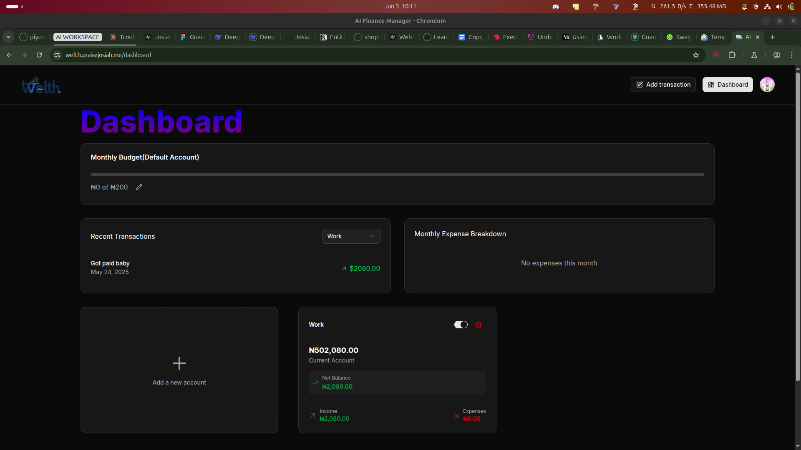
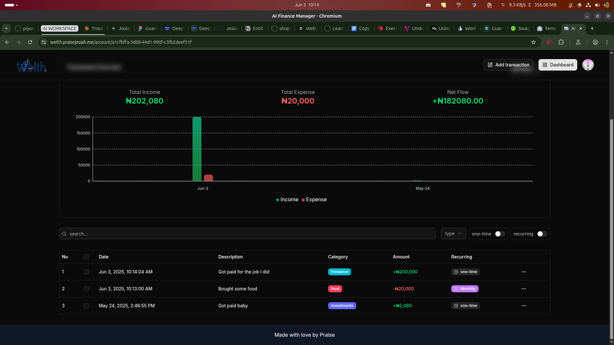

# 💸 Welth – Personal Finance Tracker

**Welth** is a full-stack personal finance management tool designed to give you complete control over your spending, income, and budgeting — all in one place.

It features a robust authentication system powered by Clerk (with Google SSO support), seamless user experience with Shadcn UI, and smart automation through Inngest and Gemini AI to keep your finances running smoothly.

---

## 🚀 Features

- 🔐 **Auth with Clerk** (email + Google SSO)
- 🧾 **Multiple accounts** with customizable initial balances
- 💰 **Income & expense tracking** with support for recurring transactions
- 📊 **Budgets per account** and monthly email alerts when you hit 80% of your limit
- 🔁 **Recurring transaction automation** via Inngest workflows
- 📈 **Monthly financial insights and summaries** powered by Gemini AI
- 📮 **Coming Soon**: Upload transaction receipts to auto-generate entries using Gemini AI

---

## 🖼️ Screenshots





---

## 🧠 Why I Built This

As someone who likes to *pocket-watch* every naira I spend, I built Welth to help me track exactly where my money goes. It started as a personal project to manage my spending but grew into something that helps automate and analyze financial behavior intelligently.

---

## 🛠️ Tech Stack

| Tech          | Purpose                                |
|---------------|----------------------------------------|
| **Next.js**   | Frontend and backend (Fullstack app)   |
| **Clerk**     | Authentication                         |
| **Prisma**    | ORM for PostgreSQL                     |
| **PostgreSQL**| Database                               |
| **Inngest**   | Job scheduling & workflows             |
| **Gemini API**| AI-generated monthly reports           |
| **Resend**    | Email delivery                         |
| **Shadcn/UI** | Clean UI components                    |

---

## ⚙️ Environment Variables

Create a `.env` file in the root directory and add the following (replace `***************` with your actual values):

```env
# Clerk Auth
NEXT_PUBLIC_CLERK_PUBLISHABLE_KEY=***************
CLERK_SECRET_KEY=***************
NEXT_PUBLIC_CLERK_SIGN_UP_URL=/sign-up
NEXT_PUBLIC_CLERK_SIGN_IN_URL=/sign-in
NEXT_PUBLIC_CLERK_SIGN_UP_FALLBACK_REDIRECT_URL=/sign-up
NEXT_PUBLIC_CLERK_SIGN_IN_FALLBACK_REDIRECT_URL=/sign-in

# Supabase DB via connection pooling
DATABASE_URL="postgresql://<your-pool-connection-string>"

# Direct DB connection (for Prisma migrations)
DIRECT_URL="postgresql://<your-direct-connection-string>"

# Email
RESEND_API_KEY=***************

# Gemini AI
GEMINI_API_KEY=***************
```


🧪 Running Locally
1. Clone the repo
``` bash

git clone https://github.com/yourusername/welth.git
cd welth
```


2. Install dependencies
```bash

pnpm install
# or
npm install
```

3. Setup environment variables
Create a .env file in the root directory and add the variables above.

4. Run the app
```bash

pnpm dev
# or
npm run dev
```

📬 Monthly Reports & Emails
Monthly emails are automatically sent when your expenses reach 80% of your budget.

AI-generated financial summaries and insights are sent at the end of each month using the Gemini API.

Inngest handles all background workflows, including recurring transaction creation and report delivery.

🚧 Coming Soon
🤖 Receipt Scanner: Upload receipts and auto-generate transactions using Gemini AI

📱 Mobile-friendly UI enhancements

🔐 Two-factor authentication via Clerk

🙌 Contributing
Contributions are welcome! If you have ideas, bug fixes, or enhancements, feel free to open an issue or submit a pull request.

📄 License
MIT

Built with love, frustration, and a need to know where my money is going 🫰💸